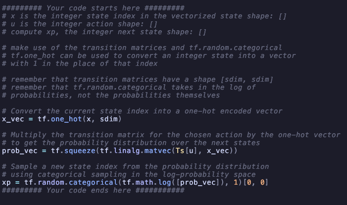
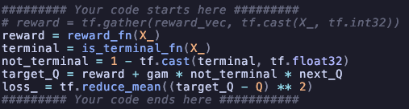

# Markovian Drone

Note-1: I got the basic code from [CS237B_HW1](https://github.com/PrinciplesofRobotAutonomy/CS237B_HW1/tree/master/Problem_1) It had three files: `q_learning.py, utils.py, and value_iteration.py`. I made `utils_other.py` to be separate from the main `utils.py` file and filled in the missing parts in `q_learning.py` and `value_iteration.py`.

## Value Iteration
The first four questions are about value iteration, and the remaining ones are about Q-learning; therefore, I have used the headers accordingly.

#### Question-1
Given $n = 20$, $\sigma = 1$, $\gamma = 0.95$, $x_{eye} = (15, 7)$, and $x_{goal} = (19, 9)$, write code that uses value iteration to find the optimal value function for the drone to navigate the storm. Recall that value iteration repeats the Bellman update
$$
\left\{ 
  \begin{array}{c l}
    {R(x, u) + \gamma \sum_{x' \in X} p(x' \mid x, u) V(x')} & \quad \textrm{if } x \textrm{ is not a terminal state}\\
    R(x, u)               & \quad \textrm{otherwise}
  \end{array}
\right.
$$
until convergence, where $p(x'\mid x, u)$ is the probability distribution of the next state being $x'$ after taking action $u$ in state $x$, and $R$ is the reward function.

#### Answer-1
To solve the question, I had to complete the missing parts of the `value_iteration` function in the `value_iteration.py` file. I have included all the necessary information as comments in the code.

#### Question-2
Plot a heat map of the optimal value function obtained by value iteration over the grid $X$, with $x = (0,0)$ in the bottom left corner, $x = (n-1, n-1)$ in the top right corner, the $x_1 \textrm{-axis}$ along the bottom edge, and the $x_2 \textrm{-axis}$ along the left edge. *Hint: We provide a function that plots the heat map: `visualize_value_function()

#### Answer-2
Using the Bellman equation and the code from the first answer, I was able to compute an optimal value function. For visualization, I utilized the `visualize_value_function()` from the `utils.py` file as mentioned.
The output is:

The output appeared fine and nearly perfect because the questions and the code indicated that there was wind at $(15,7)$, and the arrows demonstrated that the wind should be avoided as much as possible to increase the chances of moving uninterruptedly.

#### Question-3
Recall that a policy $\pi$ is a mapping $\pi : X \rightarrow U$ where $\pi(x)$ specifies the action to be taken should the drone find itself in state $x$. An optimal value function $V^*$ induces an optimal policy $\pi^*$ such that
$$
\pi^*(x) \in \begin{array}{c l}
	\textrm{argmax} \\
	{u \in U}
\end{array}
\left\{ 
	R(x, u) + \gamma \sum_{x' \in X} p(x' \mid x, u) V^*(x')
\right\}
$$
Note that the optimal policy is only defined for non-terminal states. Use the value function you computed in part $(a)$ to compute an optimal policy. Then, use this policy to simulate the MDP starting from $x = (0,0)$ over $N = 100$ time steps.

#### Answer-3
To answer that question, I created two functions that reside in `utils_other.py`. In the first function, I utilized the formula provided by the question to determine the best action for each state and then used that information to establish the best policy. Below is the code, complete with comments that explain things as necessary:

Then, the second function used this best policy and the probabilities of the value function to calculate the drone's route from the starting point to the ending (reward) point. Below is the code, complete with comments that explain things as necessary:

Important Note: There is a very important concept for these two functions. Since we calculated the best action for each state, we initially looped over states and then over actions. However, the transition matrices were created in the exact opposite order. This means that we have to change the ordering of rows and columns to achieve the finalized form of the policy and route. The process is straightforward because it involves just transposing, but this part might not be immediately obvious. I realized this when I attempted to visualize the results and saw the transposed version of what I was achieving.

#### Question-4
Plot the policy as a heat map. Plot the simulated drone trajectory overlaid on the policy heat map, and briefly describe in words what the policy is doing. Hint: Feel free to modify `visualize_value_function()` or write it from scratch yourself.

#### Answer-4
Visualizing the value function wasn't the answer to this question, so I created my own visualization function, which can be found in `utils_other.py`.
Here is the output:

This looked nearly perfect because the route adheres to the heatmap and follows the same rules. Normally, at the final part, it should terminate and not continue to move, but I couldn't figure out why it does not stop and continues to move instead. Even though it flew past the final point, the drone comes back because the best action is to return, which can also be observed on the heatmap.

Note: To reproduce the same results, run `value_iteration.py`. Although the output of the `value_function` will be the same, the last part may differ (most probably) because it utilizes the probabilities of the value function.

#### Question-5
Given the same environment, sample $10^5$ state transition triples
$$
(x_i,u_i,x'_i) \ \ \ \ \ \ \ \ \ \ \ \forall i \in [1, 10^5]
$$
Make sure to generate transition samples with appropriate probability of getting blown off course by the storm. **Important: We are representing the state as a two dimensional vector with the two grid coordinates and the action as a single element vector.** You are free to use your own state and action representation, but another choice might require a significant amount of tuning of the resulting Q-network.

#### Answer-5 
With the help of some research on the internet and the explanations in the code, I created transition triples. Here is the code for it:

#### Question-6
In order to develop the Q-network loss function, we will start by writing down the Bellman equation of the optimal Q-function—our Q-network should aim to approximate that. Write down the expectation form of the optimal Q-function in terms of an equality
$$
Q^*(x, u) = \dots
$$
Hint: Your form should not contain the transition probabilities, since we do not know those. 
Hint: Remember to account for the reward value and whether the state is terminal.

#### Answer-6
As I understand it, the loss function for Q-learning is similar to that of any regression problem; we can use the MSE (Mean Squared Error) loss function to calculate the loss. Since Q-learning utilizes Q-networks, the output of the network can be input into the MSE function along with the actual answer to calculate the loss. However, in addition to these elements, the prediction should also utilize the Bellman equation (to make it act like the real part?). Therefore, the final form of the error would look like this:
$$
Loss = mean((R + \gamma \textrm{max}_{u'}Q(x',u') - Q(x, u))^2)
$$
Here, $R$ is the immediate reward, $\gamma$ is the discount factor, and $Q(s,a)$ are the values predicted by the network.
Here is the code for the given formula:

#### Question-7
Create a feed forward neural network for representing the Q-network. Use 3 dense layers with a width of 64 (two hidden 64 neuron embeddings).

#### Answer-7
This is pretty straightforward, here is the code:

#### Question-8
Train the neural network filling in the provided Q_learning Python function. Use the Adam optimizer. Experiment with the following step sizes ${10^{-3}, 10^{-2}, 10^{-1}}$ and pick the one that works best. 
We will now develop the Q-network loss as an L2 penalized equality (1) residual. 
$$
l = \frac 1 n \sum_{i=1}^n ||{LHS}_i - {RHS}_i||_2^2 \ \ \ \ \ \ \forall i \in S_{examples}
$$
*Hint: The expectation operator can be silently dropped since we are (1) using a quadratic residual penalty and (2) summing over all of the samples—which is equivalent to taking empirical expectation over data.*

#### Answer-8
This is also pretty straight forward, since training loop is custom and can not be used by `tf.keras.model.Sequential().fit()` we have to create a training loop using the `tf.GradientTape`. Here is the code:

#### Question-10
Note: Question-9 is below, since it is not about the codes I answered it lastly.

Question: Include a binary heat map plot that shows, for every state, if the approximate Q-network policy agrees or disagrees with the value iteration optimal policy. 
*Hint: Feel free to modify `visualize_value_function()` or write it from scratch yourself.*

#### Answer-10
I made some experimenting in this part of the project because in oppose of value function the q-learning is a stocastic approach and to be able to get the best results we may need to adjust some hyperparameters, like networks size, step size and training loops etc.

##### Experiment-1
3 Layered Network, stepsize $10^{-3}$, training step 10000:

The value function does not look that well

Same goes for heatmap as well, it nearly does not take storm (it directs to storm $(15, 7)$ while it should not) in to account and just worked like it is not there.

##### Experiment-2
2 Layered Network, stepsize $10^{-2}$, training step 10000:

Same conclusion.
##### Experiment-3
3 Layered Network, stepsize $10^{-3}$, training step 50000 (This took a lot longer):
